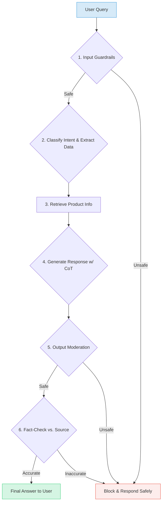

# IntelliBot: Engineering a Production-Ready LLM Chatbot

<div align="center">


</div>

<p align="center">
  
</p>

To bridge the gap between simple LLM API calls and production-grade conversational AI, I engineered **IntelliBot**, an end-to-end customer service chatbot. This project documents my process of building a reliable, safe, and sophisticated system using `gpt-4o`, focusing on critical production components like multi-stage processing, advanced reasoning, and rigorous validation.

---

## 🚀 Key System Features I Engineered

I went beyond basic prompting to build a multi-layered system that demonstrates a deep understanding of modern LLM application development.

* **🛡️ Robust Input & Output Guardrails:** I implemented a dual-layer security system using the **OpenAI Moderation API** and a custom **few-shot classifier** to detect and block harmful content, prompt injection, and jailbreak attempts.
* **⛓️ Multi-Stage LLM Processing Chain:** I designed and built a sequential pipeline where complex user queries are broken down into manageable steps. This chain **extracts structured data**, **retrieves relevant information** from a knowledge base, and then **synthesizes a coherent response**.
* **🔎 Automated Fact-Checking System:** To combat hallucinations, I developed an evaluation step where a **second "evaluator" LLM** acts as a verifier, cross-referencing the generated answer against the source product data to ensure factual accuracy before it reaches the user.
* **🧠 Advanced Reasoning with Chain-of-Thought (CoT):** I integrated **CoT prompting** to force the model to "think step-by-step," dramatically improving its ability to handle complex, multi-part questions and making its logic transparent for debugging.
* **⚙️ Guaranteed Structured Output:** I utilized OpenAI's **JSON mode** to ensure the LLM's outputs (like product classifications or extracted details) are always in a valid, machine-readable format, creating a reliable foundation for the processing pipeline.

---

##  flowchart The IntelliBot Processing Pipeline

I designed a modular, multi-step pipeline to process every user query, ensuring each response is safe, contextually relevant, and factually grounded.



---

## Chatbot in Action

Here are some examples of the final IntelliBot handling various customer queries. Each example demonstrates a different aspect of its capabilities, from product comparisons to complex reasoning and safety features.

### Query 1:


### Query 2:


### Query 3:


### Query 4:


### Query 5:


---


## 📘 Notebook Breakdown

This project is structured as a series of Jupyter notebooks, each building on the last to create a complete system.

---

### 1. Foundations: Interacting with LLMs
- **File**: [`01_Foundations_Interacting_with_LLMs.ipynb`](01_Foundations_Interacting_with_LLMs.ipynb)
- **Summary**: Covers the fundamentals of the OpenAI Chat Completions API.
- **Key Techniques**:
  - Sending basic prompts.
  - Using `system`, `user`, and `assistant` roles to guide conversations.
  - Understanding tokenization and its impact on output.
  - Counting token usage for cost management.

---

### 2. Structured Output: LLM as a Classifier
- **File**: [`02_Structured_Output_LLM_as_a_Classifier.ipynb`](02_Structured_Output_LLM_as_a_Classifier.ipynb)
- **Summary**: Uses the LLM to classify customer queries into predefined categories and guarantees a machine-readable output.
- **Key Techniques**:
  - **Classification via Prompting**: Providing categories in the `system` prompt.
  - **Guaranteed JSON Output**: Using `response_format={"type": "json_object"}` to ensure the output is always valid JSON.

---

### 3. Input Guardrails: Moderation & Security
- **File**: [`03_Input_Guardrails_Moderation_and_Security.ipynb`](03_Input_Guardrails_Moderation_and_Security.ipynb)
- **Summary**: Implements two layers of security to evaluate user inputs.
- **Key Techniques**:
  - **OpenAI Moderation API**: A free, specialized endpoint to detect harmful content.
  - **Prompt Injection Detection**: Using a few-shot prompted LLM to build a custom classifier that prevents users from overriding system instructions.

---

### 4. Complex Reasoning with Chain-of-Thought
- **File**: [`04_Complex_Reasoning_with_Chain_of_Thought.ipynb`](04_Complex_Reasoning_with_Chain_of_Thought.ipynb)
- **Summary**: Improves the LLM's reasoning by instructing it to "think step-by-step."
- **Key Techniques**:
  - **Chain-of-Thought (CoT)**: Structuring the prompt to make the model outline its reasoning process before providing a final answer.
  - **Interpretability**: The model's "inner monologue" is exposed, making it easy to debug its logic.

---

### 5. System Design: Building LLM Chains
- **File**: [`05_System_Design_Building_LLM_Chains.ipynb`](05_System_Design_Building_LLM_Chains.ipynb)
- **Summary**: Creates a multi-step pipeline where the output of one LLM call feeds into the next.
- **Key Techniques**:
  - **Prompt Chaining**: A 3-step chain:
    1.  **Extraction**: An LLM extracts product names from the user query into a JSON list.
    2.  **Retrieval**: Python code fetches product details from a local catalog (`products.json`).
    3.  **Generation**: A final LLM call synthesizes the retrieved data into a conversational response.

---

### 6. Output Validation: Preventing Hallucinations
- **File**: [`06_Output_Validation_Preventing_Hallucinations.ipynb`](06_Output_Validation_Preventing_Hallucinations.ipynb)
- **Summary**: Adds a final, critical evaluation step to ensure the AI's response is safe and factually accurate.
- **Key Techniques**:
  - **Output Moderation**: Screening the generated response for harmful content.
  - **Fact-Checking with an Evaluator LLM**: A second LLM call compares the generated response against the source product data to confirm factual correctness.

---

### 7. End-to-End Conversational Agent
- **File**: [`07_End_to_End_Conversational_Agent.ipynb`](07_End_to_End_Conversational_Agent.ipynb)
- **Summary**: Assembles all previous components into a single, cohesive, and interactive chatbot application.
- **Key Features**:
  - **Complete AI Pipeline**: Integrates all six preceding concepts into one script (`pipeline.py`).
  - **Conversation Memory**: Maintains chat history to allow for stateful, multi-turn conversations.
  - **Interactive Chat UI**: Uses the `panel` library to create a simple graphical interface for real-time interaction.

---

## 📂 Repository Structure

The project is organized into a series of Jupyter notebooks, each building upon the last, supported by Python scripts and data files.

```bash

IntelliChain/
├── 01_Foundations_Interacting_with_LLMs.ipynb
├── 02_Structured_Output_LLM_as_a_Classifier.ipynb
├── 03_Input_Guardrails_Moderation_and_Security.ipynb
├── 04_Complex_Reasoning_with_Chain_of_Thought.ipynb
├── 05_System_Design_Building_LLM_Chains.ipynb
├── 06_Output_Validation_Preventing_Hallucinations.ipynb
├── 07_End_to_End_Conversational_Agent.ipynb
│
├── pipeline.py         # Core logic for the multi-step chatbot pipeline
├── utils.py            # Helper functions for data loading and API calls
├── products.json       # Product catalog data
│
└── outputs/            # Saved images and visual assets
├── chatbot_qa_1.png
├── chatbot_qa_2.png

```

---

## 🛠️ Technology Stack

- **Language**: Python 3.8+
- **LLM API**: OpenAI (`gpt-4o`)
- **Core Libraries**:
  - `openai`: For interacting with the OpenAI API.
  - `python-dotenv`: For managing environment variables (API keys).
  - `panel`: For creating the interactive chat UI.
  - `jupyter`: For running the notebooks.

---

## Setup and Installation

Follow these steps to get the project running on your local machine.

**1. Clone the Repository**
```bash
git clone https://github.com/nabeelshan78/IntelliChain.git
cd IntelliChain
```

**2. Set Up Your API Key**
Create a file named .env in the root directory of the project and add your OpenAI API key:
```
OPENAI_API_KEY="your-openai-api-key-here"
```
The code will automatically load this key.

---

## 🚀 How to Use

The project is designed to be explored sequentially through the notebooks.

**1. Explore the Concepts**
Work through the notebooks `01` to `06` in order. Each notebook is self-contained and explains a key concept in the AI pipeline.

**2. Run the Final Chatbot**
The final, interactive chatbot can be launched by running the `07_End_to_End_Conversational_Agent.ipynb` notebook. The last cells use the `panel` library to create and display a chat interface directly in the notebook or as a separate web application.

---
